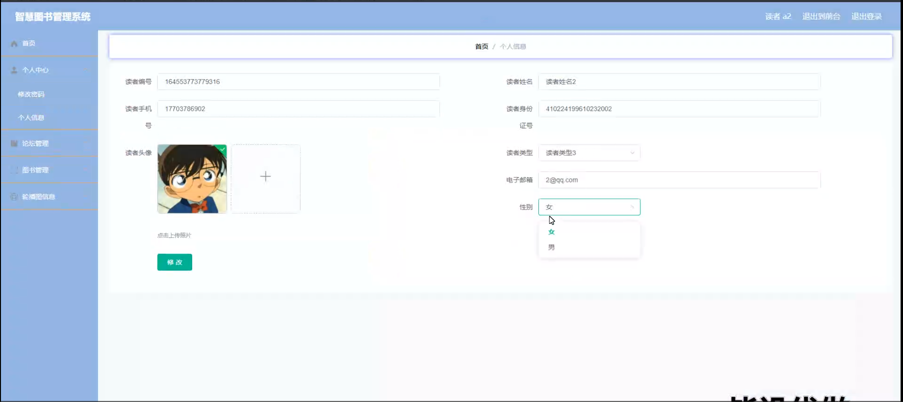
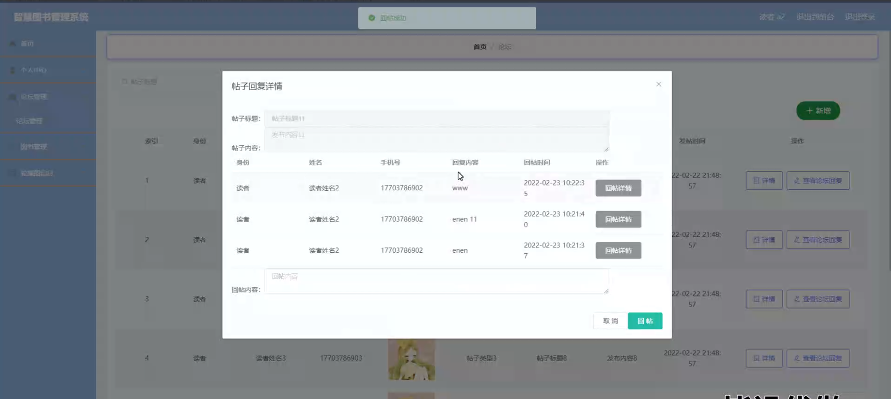

# 基于springboot的智慧图书管理系统

---
### 👉作者QQ ：1556708905 微信：zheng0123Long (支持定制修改、部署调试、定制毕设)

### 👉接网站建设、小程序、H5、APP、各种系统等

---

#### 介绍

随着信息技术的不断发展，传统的图书管理方式已经难以满足现代图书馆的需求。为了提高图书管理的效率和服务质量，我们开发了这个基于 Spring Boot 的智慧图书管理系统。该系统旨在为管理员和读者提供一个便捷、高效、智能化的图书管理和借阅平台，实现图书资源的优化配置和充分利用。

#### 技术栈

后端技术栈：Springboot+Mysql+Maven

前端技术栈：Vue+Html+Css+Javascript+ElementUI

开发工具：Idea+Vscode+Navicate

#### 系统功能介绍

（一）管理员角色  
个人中心：管理员可以在此查看和修改个人信息，如用户名、密码、联系方式等，同时能够查看系统操作记录和通知。  
基础数据管理  
读者类型管理：设置不同的读者类型，如学生、教师、职工等，并为每种类型设置相应的借阅权限、借阅期限等规则。  
书架管理：对图书馆内的书架进行编号、分类和位置标注，方便图书的存放和查找。  
图书类型管理：对图书进行分类，如文学、科技、历史等，便于读者检索和管理。  
读者管理：负责读者信息的录入、修改、删除，以及读者借阅证的办理、挂失、补办等操作。可以查看读者的借阅记录和违规情况，对违规读者进行相应的处理。  
论坛管理：监督论坛的交流内容，审核读者发布的帖子，删除不符合规定的言论，回复读者的问题和建议，维护论坛的良好秩序和氛围。  
图书管理  
图书管理：进行图书的采购、编目、入库、出库等操作。可以对图书的基本信息，如书名、作者、出版社、ISBN 等进行录入和修改。  
图书留言管理：查看读者对图书的留言和评论，了解读者的反馈，以便对图书的采购和推荐进行调整。  
图书收藏管理：掌握读者对图书的收藏情况，分析热门图书和读者的阅读偏好。  
图书借况记录管理：实时监控图书的借阅状态，包括已借、在库、预约等，及时处理超期未还等情况。  
轮播图信息：设置图书馆的宣传轮播图，展示新书推荐、阅读活动通知、图书馆开放时间调整等重要信息。  

（二）读者角色  
论坛：读者可以在论坛中与其他读者交流阅读心得、分享读书感悟，或者向管理员咨询问题。  
图书：读者能够进行图书的检索、浏览图书详情、查看图书的借阅状态，进行图书的借阅和预约操作。  
个人中心：读者可以修改个人资料，查看自己的借阅记录、预约记录、违规记录等，还可以管理自己的图书收藏和留言。  
后台管理  
论坛管理：查看和管理自己在论坛中发布的帖子和回复。  
图书管理：查看自己借阅的图书信息和借阅期限，进行续借操作。  
轮播图信息：了解图书馆的最新动态和重要通知。  

#### 系统作用

智慧图书管理系统的主要作用包括：  

提升管理效率： 为管理员提供全面的管理工具，帮助高效管理图书信息、读者信息、论坛和基础数据，确保信息的准确性和及时性。  
方便用户操作： 提供简洁直观的界面，让读者可以便捷地浏览和借阅图书、参与论坛讨论、查看公告和管理个人信息，提升用户体验。  
信息透明化： 通过公告、论坛和轮播图信息，管理员和读者可以及时传递和接收重要信息，增强信息的透明度和沟通效率。  
资源合理利用： 通过系统化的管理，确保图书资源的合理记录和使用，避免信息遗漏和资源浪费。  

#### 系统功能截图

代码结构

数据库表

登录

前台页面首页

前台页面论坛

前台页面图书

个人中心

读者端后台管理

帖子回复详情

图书借阅记录管理

管理员端书架管理

读者管理

图书管理

轮播图管理

#### 总结

基于 Spring Boot 的智慧图书管理系统通过精细的角色划分和丰富的功能模块，为管理员和读者搭建了一个高效、便捷、互动的图书管理平台。管理员能够实现全面、精准的图书管理和读者服务；读者能够轻松获取图书资源，享受优质的阅读服务。该系统有助于推动图书馆的数字化转型和智能化发展，为知识的传播和文化的传承发挥重要作用。

#### 使用说明

创建数据库，执行数据库脚本 修改jdbc数据库连接参数 下载安装maven依赖jar 启动idea中的springboot项目

前台登录页面
http://localhost:8080/zhihuitushu/front/index.html

后台登录页面
http://localhost:8080/zhihuitushu/admin/dist/index.html

管理员			账户:admin 	密码：admin
读者				账户:a1 		密码：123456
读者				账户:a2 		密码：123456
读者				账户:a3 		密码：123456